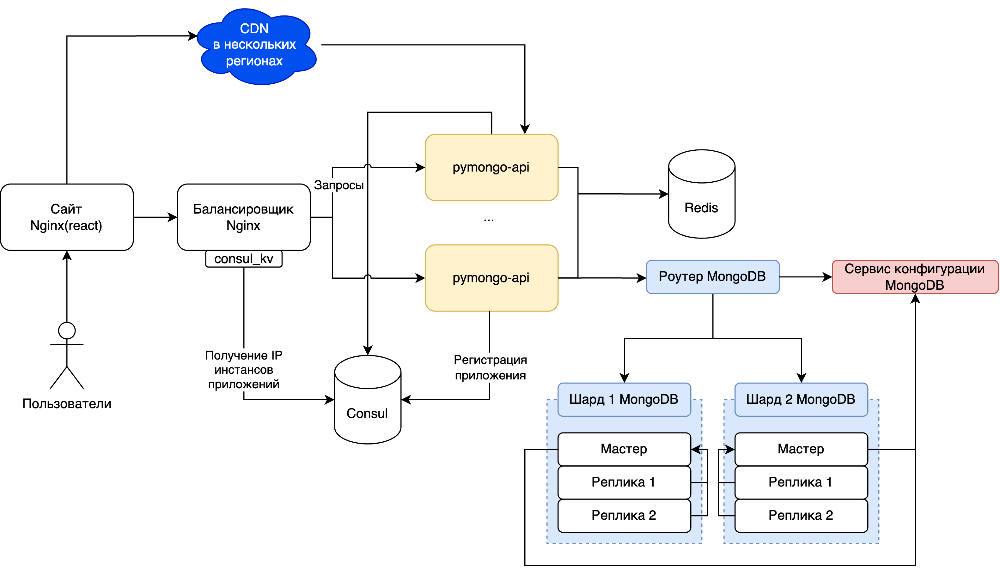

# pymongo-api

## Как запустить

Запускаем mongodb и приложение

```shell
docker compose up -d
```

Запускаем настройку кластера mongodb

```shell
chmod u+x scripts/run-shards.sh && ./scripts/run-shards.sh
```

Скрипт настроит конфиг сервер, затем шарды, а после этого роутер.

Как только все будет готово, вы можете подключиться к mongos кластеру

## Итоговая схема



Схему с этапами можно посмотреть, открыв файл `arch_sprint2.drawio`

## Как проверить

### Если вы запускаете проект на локальной машине

Откройте в браузере http://localhost:8080

### Если вы запускаете проект на предоставленной виртуальной машине

Узнать белый ip виртуальной машины

```shell
curl --silent http://ifconfig.me
```

Откройте в браузере http://<ip виртуальной машины>:8080

## Доступные эндпоинты

Список доступных эндпоинтов, swagger http://<ip виртуальной машины>:8080/docs
